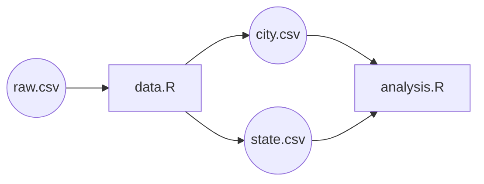
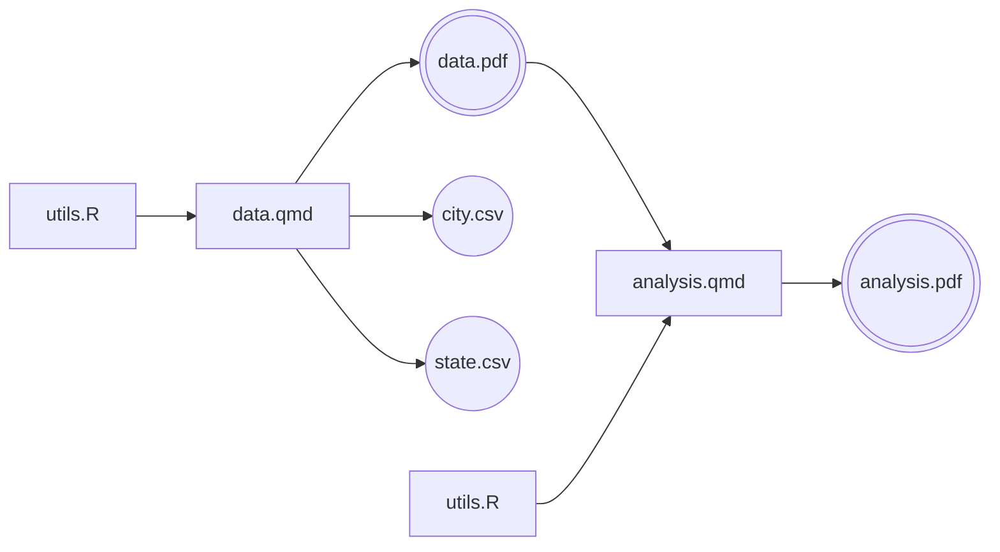
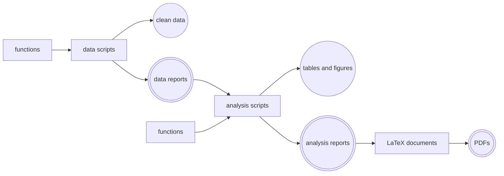

# Building with `make`

## What problem does `make` solve?

Projects grow more complex over time. You split your work into multiple files. You have to run multiple commands in a sequence, some of which make take (a lot of) time to run. So you don't. And so you end up with a mess, sometimes working with outdated files because you forgot to run some steps. 

Example: you're working with individual-level census data about individuals in US cities. You do some analysis at the city level and some analysis at the state level. It turns out that the raw data is very large, aggreagting it takes a lot of time. So you split your code into two separate files: 

- `data`: a script that turns the raw data into city-level and state-level aggregates, and
- `analysis`: a script that takes the city-level and state-level aggregates and produces the final analysis.

<a href="https://www.gnu.org/software/make/" target="_blank">Make</a> is a program that allows you to declare that `analysis` depends on `data`, and that `data` depends on the raw data. Then, when you run `make analysis`, it will automatically run the necessary steps in the right order, and only re-run the steps that are necessary (for example, if you change the code in `analysis` but not in `data`, it will only re-run `analysis` and not `data`).

## How this works in practice

In practice, you will write a `Makefile` that declares the dependencies between your files and the commands to run to produce each file. Then you will run `make` from the terminal to execute the commands in the right order.

### The Makefile

The `Makefile` executes terminal commands, that you place at the root of your project. You can use it to run any command you would normally run in the terminal. For example, you can use it to run Python scripts, R scripts, or any other command-line tool. Overview of the main terminal commands for languages supported by RECAP templates:


## R

- Execute an R script: `Rscript path/to/script.R`
- Render a Quarto document: `quarto render path/to/document.qmd`

## Python
Coming soon!

## Stata
Coming soon!



### Our example



## R

The build process can be visualized as a flowchart:



The `Makefile` to declare these dependencies and the commands to run would look like this:

```makefile
# analysis depends on city.csv and state.csv
analysis: analysis.R city.csv state.csv
    Rscript analysis.R

# city.csv and state.csv depend on data.R and raw.csv
city.csv state.csv: data.R raw.csv
    Rscript data.R
```

In the terminal, you can run `make analysis` to execute the necessary steps to produce the final analysis. If you change something in `data.R`, it will automatically re-run `data.R` and then `analysis.R`. If you change something in `analysis.R`, it will only re-run `analysis.R`.

You can also run `make city.csv` to only re-run the steps necessary to produce `city.csv`.

Also, if you run `make` without any arguments, it will execute the first target in the `Makefile`, which in this case is `analysis`. So you can simply run `make` to produce the final analysis, and it will automatically run the necessary steps in the right order. In fact, the first target in the `Makefile` is often called `all`, and it is a common convention to have it depend on the final outputs of your project, so that running `make` will produce all the final outputs. For example:

```makefile
all: analysis

analysis: analysis.R city.csv state.csv
    Rscript analysis.R

# ...
```

## Python
Coming soon!

## Stata
Coming soon!



### A simple, yet realistic use case: our medium template

In practice, your build process will likely be more complex than the simple example above. Our medium template is designed to handle a more realistic use case, where:

1. Raw data rarely changes. We just don't want to keep track of it with `make`. So we don't declare it as a dependency in the `Makefile`. Instead, we just assume that it's there and that it's up to date.

2. You have libraries that contain functions that are used by multiple scripts. You declare those as dependencies for all the scripts that use them. 

3. One script produces multiple outputs (for example, `data.R` produces both `city.csv` and `state.csv`), and it's hard to keep a track of all of them. This is why we prefer to declare a main output for each script and have the other outputs be untracked by make. 


## R

We prefer to use Quarto documents as the main output of each script, which allow us to keep track of a single output file for each script and have that document print nice summaries of the output. We reserve `.R` files for libraries of functions (say, `utils.R`). The build process now becomes: 



The `Makefile` to declare these dependencies would look like this:

```makefile
# analysis.pdf is the main output
all: analysis.pdf

analysis.pdf: analysis.qmd utils.R data.pdf
    quarto render analysis.qmd 

data.pdf: data.qmd utils.R
    quarto render data.qmd
```

## Python
Coming soon!

## Stata
Coming soon!



### A complex use case: our large template

Larger projects have multiple scripts that can all be run in parallel.Uou don't want to declare them one by one. This is where `make` really shines, as it can automatically determine which steps can be run in parallel and execute them accordingly. Our large templates are designed to take advantage of this feature, so that you can run multiple scripts in parallel without having to declare all the dependencies between them. Here is a conceptual diagram of how this works:



### Use `make` to run other commands

In addition to running scripts, you can also use `make` to run other commands that are necessary for your project. For example, you can use it to run tests or to clean up intermediate files. To do so, you just need to declare a target that is never produced by any of your scripts (a so-called "phony" target), and then declare the commands to run for that target. For example, you can declare a `clean` target that deletes all the intermediate files:

```makefile
clean:
    rm -rf intermediate_files/
```

Our medium and large templates make heavy use of this feature and declare a series of targets that allow you to run useful commands for your project. You can discover them by typing `make help` in the terminal, which will print a list of all the "phony" targets declared in the `Makefile` along with a brief description of what they do.

## More resources on `make`

- <a href="https://makefiletutorial.com/" target="_blank">Learn Makefiles by example</a>