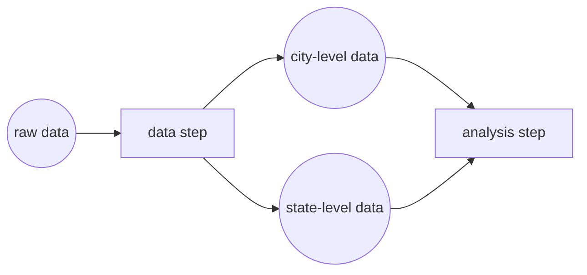
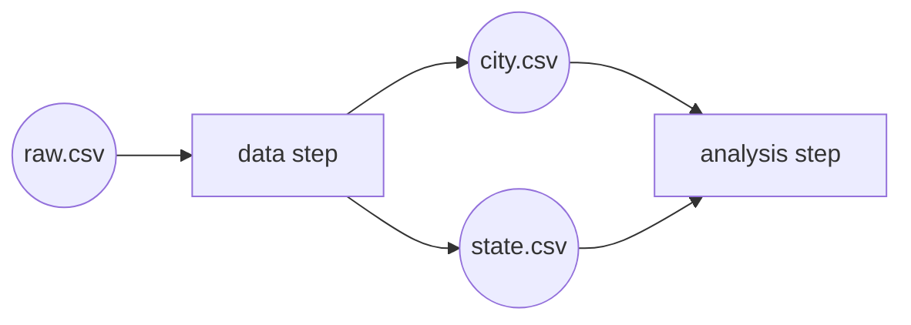
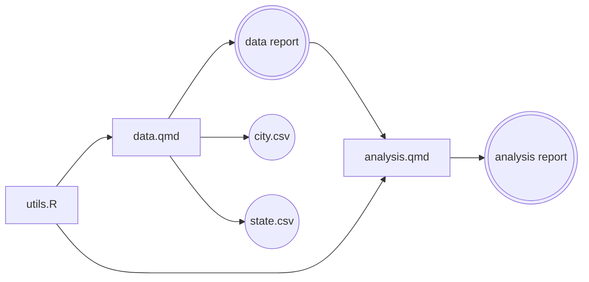
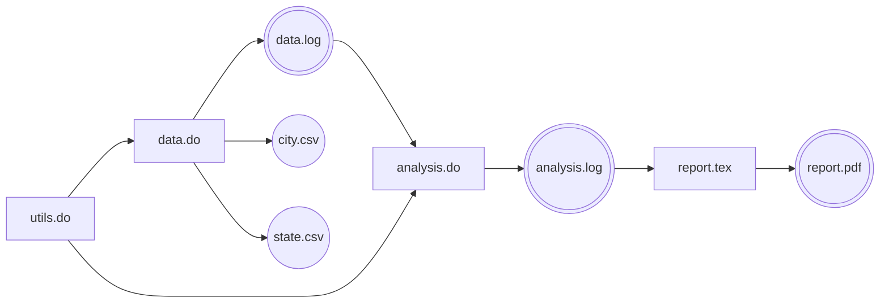
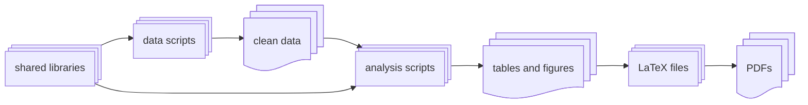

# Building with `make`

## What problem does `make` solve?

As projects grow, they almost always become messy in the same way.

You start with a single script. Then you split your work into multiple files. Some steps take a long time to run, so you stop running them every time. Eventually, you forget which steps need to be run, and in what order. You end up working with outdated files — often without realizing it.

This is not a discipline problem. It’s a tooling problem.

`make` is a small program that solves exactly this issue: it keeps track of **what depends on what**, and only runs the steps that are actually necessary.

### A motivating example

Imagine you are working with large, individual-level census data. The raw data is very big, and processing it takes a long time.

You decide to split your work into two steps:

- a **data step**, which turns the raw data into smaller, aggregated datasets, and
- an **analysis step**, which takes those aggregated datasets and produces results (tables, figures, or reports).

Conceptually, the situation looks like this:



The key idea is that **analysis depends on data**. If the data changes, the analysis must be re-run. But if the data does *not* change, re-running it is a waste of time.

### What `make` does

`make` allows you to *declare* these relationships explicitly.

You tell `make`:

- which files are **inputs**,
- which files are **outputs**, and
- which **command** produces each output.

Then, when you ask `make` to build something (for example, the final analysis), it will:

1. check which files are out of date,
2. run only the necessary steps,
3. run them in the correct order.

If you change only the analysis code, `make` will re-run only the analysis.  
If you change the data-processing code, `make` will re-run the data step *and* the analysis.

From this point on, you no longer have to remember what to run — `make` does.

## How this works in practice

In practice, using `make` means writing a small text file called a `Makefile` and placing it at the root of your project.

The `Makefile` does **not** introduce a new programming language. Instead, it simply tells `make` which terminal commands to run, and under which conditions.

Once this file exists, your workflow becomes very simple:

- you modify your code or data,
- you run `make` in the terminal,
- `make` figures out what needs to be updated.

You no longer have to remember which scripts to run, or in which order.

### The Makefile

A `Makefile` is a list of *rules*. Each rule answers the same question:

> “To produce **this file**, which **other files** does it depend on, and which **command** creates it?”

The exact commands depend on the language you are using, but the structure is always the same.



## R

In R-based projects, the `Makefile` runs **terminal commands** that execute R code.

In practice, this usually means one of two things:

- calling an R script from the command line, or
- rendering a Quarto document from the command line.

These are commands you could type directly in a terminal. `make` simply runs them for you, and keeps track of when they need to be re-run.

R terminal commands commonly used in `Makefile`s:

- Run an R script:
  `Rscript path/to/script.R`

- Render a Quarto document:
  `quarto render path/to/document.qmd`

## Python

Python support in RECAP follows the same logic.

The `Makefile` will contain commands that run Python scripts or render reports. The structure is identical to the R case; only the commands change.

*(Python examples coming soon.)*

## Stata

In R-based projects, the `Makefile` runs **terminal commands** that execute Stata `.do` files. The terminal command to run a Stata script in batch mode (i.e., in the Terminal) looks like this:

```bash
stata-mp -b do path/to/script.do
```

The exact command may vary depending on your setup and Stata version (`stata-mp`, `stata-se`, `stata-be`), but the key point is that you can run Stata scripts from the terminal, and `make` can run those commands for you.

The output will be a `.log` file containing the results of the script, and any other files that the script produces (for example, tables or figures). 


### Declaring dependencies

The key idea behind `make` is that **files depend on other files**.

For example:

- an analysis depends on processed data,
- processed data depends on raw data and a script,
- a report depends on the script that generates it.

In the `Makefile`, you declare these relationships explicitly. Once they are declared, `make` can do the bookkeeping for you.



## R

```makefile
analysis.pdf: analysis.qmd data.csv
    quarto render analysis.qmd
```

This rule means:

- `analysis.pdf` is the file we want to produce,
- it depends on `analysis.qmd` and `data.csv`,
- it is produced by running `quarto render analysis.qmd`.

If either `analysis.qmd` or `data.csv` changes, `make` will rebuild `analysis.pdf`.
If neither changes, `make` does nothing.

## Python

*(Python example coming soon.)*

## Stata

```makefile
analysis.log: analysis.do data.csv
    stata -b analysis.do
```

This rule means:

- `analysis.log` is the file we want to produce (the output of the Stata `.do` file),
- it depends on `analysis.do` and `data.csv`,
- it is produced by running `stata -b analysis.do`.

If either `analysis.do` or `data.csv` changes, `make` will rebuild `analysis.log`.
If neither changes, `make` does nothing.



### Running `make`

Once a `Makefile` exists, you interact with it entirely from the terminal.

- Running `make` builds the *default* target (usually the final output of the project).
- Running `make <name>` builds a specific output.

From the user’s perspective, this means there is a **single command** to build the project, regardless of how complex it becomes.

```bash
# Build the default output
make

# Build a specific file
make analysis.pdf
```

### A concrete example

Seeing `make` in the abstract can feel a bit opaque. Things usually click once you see a complete, but simple, example.

We’ll reuse the same situation as before: a project where raw data is expensive to process, so we separate the work into a **data step** and an **analysis step**.

Conceptually, the build process looks like this:



The important point is not the specific files, but the structure:

- one step produces intermediate data,
- another step consumes that data to produce final results,
- the analysis should only be re-run when its inputs change.



## R

In an R-based project, this often means:

- one script (or document) that prepares data,
- one script (or document) that runs the analysis.

The `Makefile` declares which files each step produces and which files it depends on.

```makefile
analysis: analysis.R city.csv state.csv
    Rscript analysis.R

city.csv state.csv: data.R raw.csv
    Rscript data.R
```

Once this file exists, you can ask `make` to build the analysis, and it will automatically run the required steps in the correct order.

```makefile
# Build the analysis (and anything it depends on)
make analysis

# Build only the processed data
make city.csv
```

## Python

The same logic applies to Python projects.

You declare which Python scripts produce which files, and which files are required by later steps. The structure of the `Makefile` is identical; only the commands change.

*(Python example coming soon.)*

## Stata

In an Stata-based project, this often means:

- one `.do` file that prepares data,
- one `.do` file that runs the analysis.

The `Makefile` declares which files each step produces and which files it depends on.

```makefile
analysis: analysis.do city.csv state.csv
    Rscript analysis.do

city.csv state.csv: data.do raw.csv
    Rscript data.do
```

Once this file exists, you can ask `make` to build the analysis, and it will automatically run the required steps in the correct order.

```makefile
# Build the analysis (and anything it depends on)
make analysis

# Build only the processed data
make city.csv
```



A useful consequence of this setup is that you can also build *intermediate* results directly. For example, you can ask `make` to produce only the processed data, without running the full analysis.

Once dependencies are declared, `make` gives you fine-grained control over what gets rebuilt — without additional effort.

## A simple, yet realistic use case: the RECAP medium template

The previous example showed the basic mechanics of `make`. Real projects, however, usually need a bit more structure.

The RECAP **medium template** is designed for projects that are still manageable by one person or a small team, but already complex enough that manually running scripts becomes error-prone.

This template is built around a few practical conventions.

### Design choices in the medium template

1. **Raw data is assumed to exist**

   Raw data rarely changes, and it is often large or stored outside the project directory. For this reason, we usually do **not** track raw data with `make`.  
   Instead, we assume it is present and up to date.

2. **One main output per step**

   Some scripts naturally produce multiple outputs. Tracking all of them quickly becomes tedious.  
   In the medium template, each step declares **one main output** that `make` tracks. Other by-products are treated as secondary.

3. **Libraries are explicit dependencies**

   When multiple steps rely on shared helper functions, those files are declared as dependencies wherever they are used.  
   This ensures that changes to shared code trigger the correct rebuilds.

These conventions are not rules. They are defaults that work well for most projects, and that you can adapt if needed.



## R

In R-based medium templates, we:

- use **Quarto documents** (`.qmd`) for main steps,
- reserve `.R` files for libraries of reusable functions,
- let Quarto reports serve as both documentation and build targets.

The resulting dependency structure looks like this:



The corresponding `Makefile` tracks only the main outputs of each step.

```makefile
all: analysis.pdf

analysis.pdf: analysis.qmd utils.R data.pdf
    quarto render analysis.qmd

data.pdf: data.qmd utils.R
    quarto render data.qmd
```

## Python

The same ideas apply to Python projects.

Each step has one main output, shared utilities are explicit dependencies, and the `Makefile` defines the build order.

*(Python example coming soon.)*

## Stata

In Stata-based medium templates, we:

- use `.do` files for data-related steps and libraries of reusable functions. Their main outputs (`.log` files) serve as build targets;
- use `.tex` files for final reporting steps.

The resulting dependency structure looks like this:



The corresponding `Makefile` tracks only the main outputs of each step.

```makefile
all: report.pdf

report.pdf: report.tex analysis.log
    pdflatex report.tex

analysis.log: analysis.do utils.do data.log
    stata-mp -b analysis.do

data.log: data.do utils.do
    stata-mp -b data.do
```


## A complex use case: the RECAP large template

Some projects eventually grow beyond a single data step and a single analysis.

You may have:
- multiple data-cleaning scripts,
- several independent analyses,
- many tables and figures,
- one or more papers or presentations that reuse the same results.

At this scale, the problem is no longer *how to write scripts*, but *how to keep everything consistent*.

The RECAP **large template** addresses this by organizing the entire project around a simple, explicit pipeline with **three stages**, plus shared libraries of reusable code.

### The three stages of a large RECAP project

Every RECAP large template follows the same high-level structure:

1. **Data → clean data**  
   Scripts take raw or external data and produce cleaned, analysis-ready datasets.

2. **Analysis → tables and figures**  
   Analysis scripts consume cleaned data and produce reusable outputs such as tables and figures.

3. **LaTeX → PDFs**  
   LaTeX documents collect tables and figures and produce final outputs (papers, appendices, slides).

In addition to these stages, large projects almost always rely on **libraries of shared functions** used across the data and analysis steps. These library files are declared as dependencies to all the data and analysis scripts, so that changes to shared code automatically trigger rebuilds.

Conceptually, the project looks like this:



Each stage depends on the previous one, but *within* a stage, many scripts are independent. Shared libraries may affect multiple stages. Once these dependencies are declared, `make` can:

- rebuild only what is affected by a change,
- skip everything else,
- run independent steps in parallel when possible.

Crucially, **you do not manage this execution logic yourself**.  
You write scripts that produce files, and the `Makefile` takes care of how everything fits together.



## R

In our large R template, this means:

- data and analysis steps implemented as Quarto documents,
- shared helper functions stored in `.R` library files,
- LaTeX documents that reuse tables and figures generated earlier.

Library files are declared as dependencies for both data and analysis steps, ensuring that changes to shared functions propagate correctly.

You do **not** need to understand how the `Makefile` discovers targets or schedules execution in order to use the template. For day-to-day work, it is enough to know that:

- changing a data script rebuilds cleaned data and downstream results,
- changing a shared library may rebuild both data and analysis outputs,
- changing analysis code rebuilds tables and figures,
- changing LaTeX code only rebuilds PDFs.

## Python

The same structure applies to Python projects.

Python scripts generate cleaned data and analysis outputs, while shared utility modules provide reusable functions for both stages. The `Makefile` ensures everything stays synchronized.

*(Python examples coming soon.)*

## Stata

In our large Stata template, this means:

- data and analysis steps implemented as `.do` files,
- shared helper functions stored in `.do` files,
- LaTeX documents that reuse tables and figures generated earlier.

Library files are declared as dependencies for both data and analysis steps, ensuring that changes to shared functions propagate correctly.

You do **not** need to understand how the `Makefile` discovers targets or schedules execution in order to use the template. For day-to-day work, it is enough to know that:

- changing a data script rebuilds cleaned data and downstream results,
- changing a shared library may rebuild both data and analysis outputs,
- changing analysis code rebuilds tables and figures,
- changing LaTeX code only rebuilds PDFs.


### Learning more about `make`

The `Makefile` used in the large template is intentionally more advanced than what is covered on this page. You are not expected to understand it immediately.

If you want to customize or extend it, the recommended approach is:

1. **Read the `Makefile` in the template**, focusing on the dependencies it declares rather than the syntax.
2. **Use external tutorials** to learn how `make` works in more detail.

Links to beginner-friendly `make` resources are provided at the end of this page.

### Using `make` for other tasks

So far, we have focused on using `make` to build data, analyses, and documents.  
In RECAP projects, `make` also serves as the **main interface for common project tasks**.

Some tasks are not meant to produce a file, but they are still important to run in a consistent, predictable way. Rather than relying on ad-hoc terminal commands, RECAP templates expose these tasks directly through `make`.

Typical examples include:
- rebuilding everything from scratch,
- cleaning up temporary files produced during compilation,
- inspecting what the project can do.

These tasks are declared in the `Makefile` just like build steps, but they are meant to be run explicitly by the user.

```makefile
# Rebuild everything from scratch
fresh:
    rm -rf *.csv tables/ figures/ *.pdf

# Remove intermediate LaTeX files (aux, log, toc, etc.)
clean:
    rm -rf *.aux *.log *.toc
```

The exact list of available commands varies by template, but **every RECAP project provides a `make help` command**.  
Running it prints a short, human-readable list of the supported `make` targets and what they do.

If you are unsure how to interact with a project, `make help` is always the right place to start.

Using `make` this way has a major advantage: **there is a single, documented entry point for project operations**.  
Instead of remembering which scripts to run or which flags to pass, you interact with the project through a small, shared vocabulary defined by the template.

At this point, you know everything you need to *use* `make` productively in a RECAP project.  
Learning more advanced `make` features can come later, if and when you need them.

## More resources on `make`

- <a href="https://makefiletutorial.com/" target="_blank">Learn Makefiles by example</a>