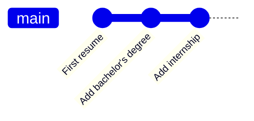
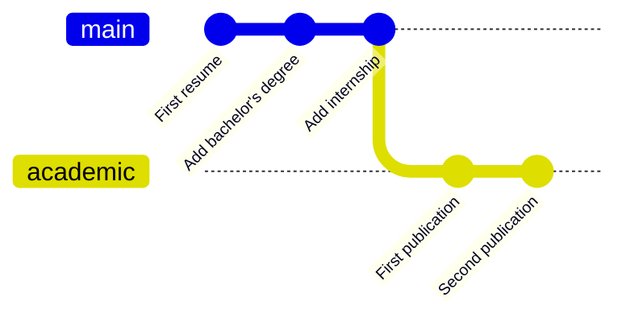
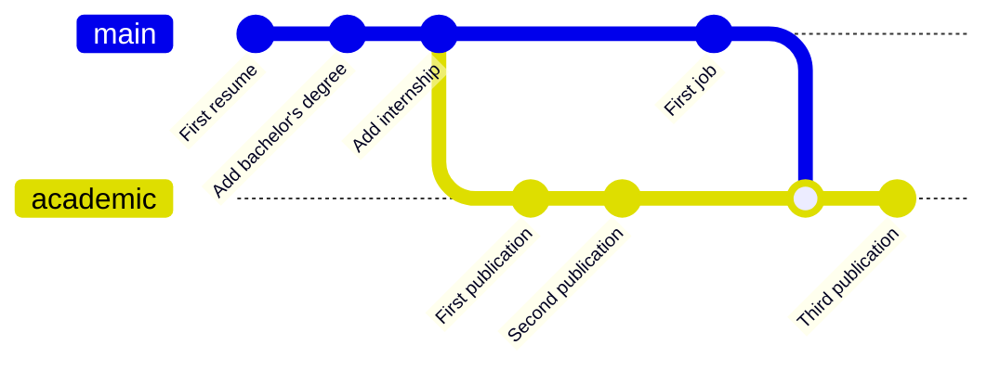

# What is Git(Hub)? Why do we need it? 

## What problem does Git solve? 

Think of your resume: it evolves over time and, sometimes, you make special versions for special job applications (one for industry jobs, another for academic jobs). In the end, you end up with a messy folder with names like cv, cv_v1, cv_academic_v2, etc. If you're not consistent with your naming policy, you will probably get lost. 

## Git and GitHub

Git solves this problem, as well as other problems (it also allows collaborative work, but we won't talk about this here). It is specialized at handling plain text files (i.e., code), although it can also handle other files (more on this later). 

GitHub is an online hosting platform that provides an array of services built on top of the Git system (similar platforms include Bitbucket and GitLab). We don't need GitHub to use Git, but it will make our lives much easier. In particular, GitHub stores a copy of your code online.

# Important concepts

## Committing (and staging)

Let's get back to our resume example: you create your resume (resume_v1). Then, you update it to reflect that you spent one more year at the job. You have two options: either you overwrite your file (and lose the old version forever), or you create a new version that you save in another file (resume_v2), letting the mess begin. 

With git, you don't have to make this choice. Instead, you take snapshots of your resume everytime you need it. Each of these snapshots is called a **commit**. Each commit records only what it added and removed to the previous commit, allowing you to keep track of the changes you made. If you feel like you need something from the past, you can always go back to your previous commits to see how your resume was back then. 

Here is an example of three commits in a row: 



{: .important-title }
> When should I commit?
>
> When you feel like you can write a short message about it *and* you know your code works (so you know that you're taking a snapshot of something safe; more on this right below). 

## Reverting

You have added your internship to your resume and are now about to modify your Hobby section. After a few hours, you have modified the resume all around, and you're not happy with it. You can just **revert** your changes and go back to how your code was at the "Add internship" commit.

This is very useful, especially if you let an AI write code for you: if you/it broke something, you can always revert to a safe state of your code. Remember: you should only commit your changes when you're sure that all your code works well.

## The (local and remote) repository

Your resume has sections: education, work, volunteering, etc. Imagine that you store each of these sections in a separate file. The folder containing all these files is called the **repository** (or repo). This is where all the files relevant to your project will live. 

Really, you have two repositories: the **local** repository, on your computer, and the **remote** repository (on GitHub). 

## Staging

Let's say that today, you updated two sections: your work experience and your education. You're happy with how you updated your work experience, but you feel like your education section isn't quite ready yet. So you only want to commit your work experience. To do that, you **stage** the changes to your work experience file and don't stage the changes to your education section. 

Staging allows you to select the changes you will want to commit. It will only commit those files that you staged for committing. You can still modify those files you staged after you've staged them (and before you committed them), but those additional changes won't be saved in the commit. 

{: .important-title }
> What should I stage?
>
> Everything. It's best to just stage all your changes and commit them, so you don't get confused. Why do I mention this then? Mostly because git will always ask you to stage before you commit. 

## Branches

Now let's say that you want to work on a new version of your CV. You have your main version, for industry jobs and you want another version, for your PhD applications. The academic version has an extra section: your publications. You can just open up a new branch; call it academic, and add publications to it. 



Let's say, now, that you decide to add a job to your job section. You can **checkout** your main branch, add a job to it, then checkout the academic branch again, and **merge** the changes back to the academic branch. 



{: .important-title }
> When should I create branches?
>
> When you're working on a substantial, new direction of your project that might break things that work and that you're not sure you want to keep. You create a branch, work on it, and merge it only when you're happy with it. Example, for a project that analyzes data from several countries

 ```mermaid
    gitGraph
       commit id: "First commit"
       commit id: "Project setup"
       commit id: "Add US data"
       commit id: "Do basic analysis"
    branch data-UK
        commit id: "Clean data"
        commit id: "Update analysis"
    checkout main
    merge data-UK
        commit id: "Finalize report"
```

## Backing up your work online: pushing (and pulling)

Git doesn't automatically save your work online. That's because it's designed for collaborative projects where someone might review your changes before they're saved online. You can accumulate a few commits locally, and then saving them online. We say that you **push** changes from your local repository to the remote repository.

**When should I push my changes?** Right after you commit, so you're sure that your all your work is safely stored on the remote. 

Likewise, git doesn't automatically syncs what's online to your local machine. In fact, it doesn't even check automatically what's online. The action of checking what's online is called **fetching** and the action of downloading those changes is called **pulling**. So you fetch the latest commits from the remote repo, and then you pull them. 

Why bother with pulling, especially if you're the only one working on your project? Because you might alternate between different machines; e.g., your computer and a GitHub Codespace. 

{: .important-title }
> When should I fetch and pull?
>
> Whenever you switch to a new machine, so you're sure you're always working with the latest version of the code.

# Special files

## README

README files are special in GitHub because they act as repo landing pages. For a project tied to a research paper, this is where you should be explicit about the goal of the research paper, the software requirements, how to run the analysis, and so forth (e.g. [here](https://github.com/grantmcdermott/bycatch)). READMEs should be written in [Markdown](https://www.markdownguide.org/), which GH automatically renders.

## .gitignore

A .gitignore file tells Git what to ignore (i.e., never commit). This is especially useful if you want to exclude whole folders or a class of files (e.g. based on size or type). 

{: .important-title }
> What should I ignore?
>
> Everything that can be produced and reproduced identically by your code. So you should only commit to git the raw data used by your project and your code. You can reproduce everything else by just running your code. In practice, this means that, for instance, the rendered pdf of your final report can be safely ignored. RECAP templates have a series of sane defaults, so you shouldn't have to think about this too much. 

# How to do this in practice

<iframe width="560" height="315" src="https://www.youtube.com/embed/i_23KUAEtUM?si=DYDsVJPeLMP9o26J" title="YouTube video player" frameborder="0" allow="accelerometer; autoplay; clipboard-write; encrypted-media; gyroscope; picture-in-picture; web-share" referrerpolicy="strict-origin-when-cross-origin" allowfullscreen></iframe>

# What to do when something goes wrong with git 

Check out

- [Oh shit, Git!](http://ohshitgit.com/)
- [Burn it down and start again](http://happygitwithr.com/burn.html)  
