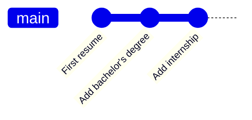

# Using Git in practice

This page explains how to **use Git effectively in day-to-day work** with RECAP projects.

It assumes that:
- Git is installed and configured,
- your RECAP project is already open in your editor.

If you are looking for an introduction to what Git is and how to get started, see  
**[Getting started with Git](./)**.

---

## Git concepts and good practices

This section introduces the main Git concepts you need to work confidently with RECAP projects.  
These ideas are independent of the editor you use.

---

### Commits (and staging)

Let’s start with a simple example.

Imagine your résumé. You create an initial version. Later, you update it to reflect a new degree or job. You have two options: overwrite the file and lose the old version forever, or create a new file (`cv_v2`, `cv_final`, `cv_final_really`), letting the mess begin.

Git avoids this problem by letting you take **snapshots** of your work over time.  
Each snapshot is called a **commit**.

A commit records:
- what was added and removed since the previous commit,
- along with a short message describing the change.

If you ever need something from the past, you can go back to a previous commit and see exactly how your project looked at that time.



{: .important-title }
> When should I commit?
>
> A good rule of thumb is:
>
> - commit when your code runs,
> - and when you can describe what you just did in one sentence.
> 
> Commits are meant to capture **safe states** of your project. A good habit is to commit **before** making large or risky changes, especially when using AI tools.

#### A note on staging

Before creating a commit, Git asks you which changes should be included in the snapshot.  
This selection step is called **staging**.

Staging exists so that, in principle, you can commit only part of your changes.  
In practice—especially when starting out—it is usually best to:
- stage **all** your changes,
- and commit them together.

Git will always require you to stage something before committing, so you will encounter this concept naturally when using Git in an editor.

---

### Reverting: going back to a safe state

Sometimes, things don’t work out.

You may try a refactor, explore a new idea, or let an AI assistant modify several files at once—and end up with a result you don’t like.

Git allows you to **revert** to an earlier commit and return to a known good state of your project.

This makes experimentation low-risk:
- you can try things freely,
- knowing you can always undo and continue from a safe snapshot.

This is why you should commit **before** making large or risky changes.

---

### The repository: local and remote

All files related to your project live in a **repository** (often shortened to *repo*).  
In practice, you usually have two copies of the repository:
- a **local repository** on your computer,
- and a **remote repository** hosted online (for example on GitHub).

You can think of the remote repository as:
- a backup of your work,
- and a reference point you can return to from any machine.

This distinction is important for understanding how work is saved and recovered.

---

### Saving your work online: pushing

Git does not automatically save your work to the remote repository.

After creating commits locally, you explicitly **push** them to GitHub.  
Once pushed, your work is safely stored online.

{: .important-title }
> A good habit
> 
> - Commit your changes,
> - Then push them, so your work is not tied to a single machine.

Whether changes have been pushed or not often matters when debugging problems later.

---

### Getting updates: fetching and pulling

Git also does not automatically update your local copy with what is stored online.

- **Fetching** means checking whether new commits exist on the remote repository.
- **Pulling** means downloading those commits into your local repository.

This matters even if you work alone, for example when:
- switching between machines,
- alternating between a local setup and a GitHub Codespace.

{: .important-title }
> A good habit
>
> Pull when you start working on a project, especially on a new machine.

---

### Branches: experimenting without risk

A **branch** lets you work on an alternative version of your project without affecting the main one.

Returning to the résumé example, you might keep:
- one version for industry jobs,
- another version for academic applications.

In Git, this corresponds to creating a new branch and making changes there.

 ```mermaid
    gitGraph
       commit id: "First commit"
       commit id: "Project setup"
       commit id: "Add US data"
       commit id: "Do basic analysis"
    branch data-UK
        commit id: "Clean data"
        commit id: "Update analysis"
    checkout main
    merge data-UK
        commit id: "Finalize report"
```

Branches are useful when:
- exploring a new direction,
- adding new data or methods,
- or making changes you are not sure you want to keep.

You can merge a branch back into the main version once you are happy with the result.

{: .important-title }
> **How to use branches with RECAP templates**
>
> You do not need a complex branching structure to work effectively.  
> The appropriate setup depends on the RECAP template you are using:
>
> **Small templates**  
> Use a single branch (`main`).  
> Commit regularly and keep everything on one line of development.
>
> **Medium templates**  
> Use a main branch (`main`) for stable work, and create temporary branches when trying **new ideas or substantial changes** (for example, a new analysis approach or a data cleaning rewrite).  
> Merge these branches back into `main` once you are satisfied.
>
> **Large templates**  
> Use:
> - a `main` branch that captures **important milestones** in the life of the project (for example, paper submissions),
> - a `dev` branch for day-to-day work,
> - and temporary branches for **experiments**, such as adding a new dataset, testing a different specification, or restructuring the analysis.
>
> This structure keeps stable versions easy to identify, while still allowing active experimentation.

Branches are optional, but powerful.

---

### README: explaining your project

A `README` file acts as the landing page of a repository, especially on GitHub.

For research projects, a good README typically explains:
- the goal of the project,
- the software requirements,
- how to run the analysis,
- and how outputs are generated.

READMEs are written in Markdown, which GitHub renders automatically.

RECAP templates include starter README files that you can adapt as your project evolves.

---

### `.gitignore`: what not to track

Not all files should be tracked by Git.

A `.gitignore` file tells Git which files or folders should never be committed.

As a general principle:
- commit your code and raw inputs,
- ignore anything that can be regenerated by running the code (for example, compiled documents or intermediate outputs).

RECAP templates include sensible `.gitignore` defaults, so you usually do not need to configure this yourself.

---

## Using Git in practice (by IDE)

The exact steps for using Git depend on the editor you are using.

Rather than duplicating instructions here, each option below links to a short walkthrough video showing the typical workflow in that environment.

The underlying Git concepts are the same across all editors.

<div class="tab-container">
  <div class="tab-buttons">
    <button class="active" data-tab="tab-3"> VS Code</button>
    <button data-tab="tab-4"> Positron</button>
    <button data-tab="tab-5"> RStudio</button>
  </div>

  <div id="tab-3" class="tab-panel active">
    <iframe width="560" height="315" src="https://www.youtube.com/embed/i_23KUAEtUM?si=DYDsVJPeLMP9o26J" title="YouTube video player" frameborder="0" allow="accelerometer; autoplay; clipboard-write; encrypted-media; gyroscope; picture-in-picture; web-share" referrerpolicy="strict-origin-when-cross-origin" allowfullscreen></iframe>
  </div>

  <div id="tab-4" class="tab-panel">
    Git in Positron works exactly like in VS Code. So you can follow the same steps as in the VS Code video.
  </div>

  <div id="tab-5" class="tab-panel">
    <iframe width="560" height="315" src="https://www.youtube.com/embed/gbOjLlDcGvA?si=uPy6xJWZ8D2WGhLd" title="YouTube video player" frameborder="0" allow="accelerometer; autoplay; clipboard-write; encrypted-media; gyroscope; picture-in-picture; web-share" referrerpolicy="strict-origin-when-cross-origin" allowfullscreen></iframe>

    Start with this video and watch all the following videos in the playlist for an overview of using Git in RStudio.
  </div>
</div>

---

## When something goes wrong

Mistakes happen. Git is designed to help you recover safely — if you use it conservatively.

This section explains what to do when things don’t go as expected.

> Coming soon: detailed guidance on common problems and how to fix them.

<!-- --- -->

<!-- ### Prefer reverting over rewriting history -->

<!--
Explain:
- why reverting is safer
- why rewriting history causes problems
- especially for beginners
-->

<!-- --- -->

<!-- ### Large or confusing changes (especially from AI tools) -->

<!--
Commit before AI changes.
Review diffs.
Revert if needed.
Git as an AI safety net.
-->

<!-- --- -->

<!-- ### Reading and understanding Git error messages -->

<!--
Encourage copying error messages.
Asking an AI to explain them.
Not panicking.
-->

<!-- --- -->

<!-- ### External resources for recovery -->

<!--
Links:
- Oh Shit, Git!
- Happy Git with R
-->

---

## Summary

Git is not something you need to master before starting a RECAP project.

In RECAP, Git acts as a **safety net**:
- commits let you save safe states of your work,
- reverting lets you undo changes when something breaks,
- pushing ensures your work is safely backed up online,
- and branches let you experiment without risk.

You can start with a simple workflow and adopt more advanced practices only when they become useful.  
RECAP templates are designed so that good Git practices emerge naturally as your project grows.

If you ever feel unsure:
- commit before making large changes,
- push when something important works,
- and remember that most mistakes are reversible.

To see how these ideas translate into concrete actions, watch the **IDE-specific walkthrough videos** in Part II above.

Git is there to make research **safer, not harder**.


<!--
Reinforce:
- Git as a safety net
- Concepts first, tools second
- Conservative workflows scale best
-->