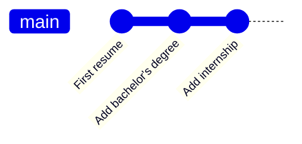

# Using Git in practice

This page helps you **work safely and confidently with Git** in RECAP projects.

RECAP does not try to teach Git exhaustively. Instead, this page focuses on:
- the key concepts you need to understand what Git is doing,
- how to learn Git through the tools you already use (IDEs, videos, references),
- and how to find the right help when you need it.

It assumes that:
- Git is installed and configured,
- and you are already working inside a RECAP project.

If you are looking for a gentle introduction to what Git is and how to get started, see  
**[Getting started with Git](./)**.

---

## Git concepts and good practices

This section introduces the main Git concepts you need to work confidently with RECAP projects.  
These ideas are independent of the editor you use.

---

### Commits (and staging)

Let’s start with a simple example.

Imagine your résumé. You create an initial version. Later, you update it to reflect a new degree or job. You have two options: overwrite the file and lose the old version forever, or create a new file (`cv_v2`, `cv_final`, `cv_final_really`), letting the mess begin.

Git avoids this problem by letting you take **snapshots** of your work over time.  
Each snapshot is called a **commit**.

A commit records:
- what was added and removed since the previous commit,
- along with a short message describing the change.

If you ever need something from the past, you can go back to a previous commit and see exactly how your project looked at that time.



{: .important-title }
> When should I commit?
>
> A good rule of thumb is:
>
> - commit when your code runs,
> - and when you can describe what you just did in one sentence.
> 
> Commits are meant to capture **safe states** of your project. A good habit is to commit **before** making large or risky changes, especially when using AI tools.

#### A note on staging

Before creating a commit, Git asks you which changes should be included in the snapshot.  
This selection step is called **staging**.

Staging exists so that, in principle, you can commit only part of your changes.  
In practice—especially when starting out—it is usually best to:
- stage **all** your changes,
- and commit them together.

Git will always require you to stage something before committing, so you will encounter this concept naturally when using Git in an editor.

---

### Reverting: going back to a safe state

Sometimes, things don’t work out.

You may try a refactor, explore a new idea, or let an AI assistant modify several files at once—and end up with a result you don’t like.

Git allows you to **revert** to an earlier commit and return to a known good state of your project.

This makes experimentation low-risk:
- you can try things freely,
- knowing you can always undo and continue from a safe snapshot.

This is why you should commit **before** making large or risky changes.

---

### The repository: local and remote

All files related to your project live in a **repository** (often shortened to *repo*).  
In practice, you usually have two copies of the repository:
- a **local repository** on your computer,
- and a **remote repository** hosted online (for example on GitHub).

You can think of the remote repository as:
- a backup of your work,
- and a reference point you can return to from any machine.

This distinction is important for understanding how work is saved and recovered.

---

### Saving your work online: pushing

Git does not automatically save your work to the remote repository.

After creating commits locally, you explicitly **push** them to GitHub.  
Once pushed, your work is safely stored online.

{: .important-title }
> A good habit
> 
> - Commit your changes,
> - Work with them for a short while to ensure they are correct (it is much easier to fix mistakes before pushing),
> - Then push them, so your work is not tied to a single machine.

Whether changes have been pushed or not often matters when debugging problems later.

---

### Getting updates: fetching and pulling

Git also does not automatically update your local copy with what is stored online.

- **Fetching** means checking whether new commits exist on the remote repository.
- **Pulling** means downloading those commits into your local repository.

This matters even if you work alone, for example when:
- switching between machines,
- alternating between a local setup and a GitHub Codespace.

{: .important-title }
> A good habit
>
> Pull when you start working on a project, especially on a new machine.

---

### Branches: experimenting without risk

A **branch** lets you work on an alternative version of your project without affecting the main one.

Returning to the résumé example, you might keep:
- one version for industry jobs,
- another version for academic applications.

In Git, this corresponds to creating a new branch and making changes there.

 ```mermaid
    gitGraph
       commit id: "First commit"
       commit id: "Project setup"
       commit id: "Add US data"
       commit id: "Do basic analysis"
    branch data-UK
        commit id: "Clean data"
        commit id: "Update analysis"
    checkout main
    merge data-UK
        commit id: "Finalize report"
```

Branches are useful when:
- exploring a new direction,
- adding new data or methods,
- or making changes you are not sure you want to keep.

You can merge a branch back into the main version once you are happy with the result.

{: .important-title }
> How to use branches with RECAP templates
>
> You do not need a complex branching structure to work effectively.  
> The appropriate setup depends on the RECAP template you are using:
>
> **Small templates**  
> Use a single branch (`main`).  
> Commit regularly and keep everything on one line of development.
>
> **Medium templates**  
> Use a main branch (`main`) for stable work, and create temporary branches when trying **new ideas or substantial changes** (for example, a new analysis approach or a data cleaning rewrite).  
> Merge these branches back into `main` once you are satisfied.
>
> **Large templates**  
> Use:
> - a `main` branch that captures **important milestones** in the life of the project (for example, paper submissions),
> - a `dev` branch for day-to-day work,
> - and temporary branches for **experiments**, such as adding a new dataset, testing a different specification, or restructuring the analysis.
>
> This structure keeps stable versions easy to identify, while still allowing active experimentation.

Branches are optional, but powerful.

---

### README: explaining your project

A `README` file acts as the landing page of a repository, especially on GitHub.

For research projects, a good README typically explains:
- the goal of the project,
- the software requirements,
- how to run the analysis,
- and how outputs are generated.

READMEs are written in Markdown, which GitHub renders automatically.

RECAP templates include starter README files that you can adapt as your project evolves.

---

### `.gitignore`: what not to track

Not all files should be tracked by Git.

A `.gitignore` file tells Git which files or folders should never be committed.

As a general principle:
- commit your code and raw inputs,
- ignore anything that can be regenerated by running the code (for example, compiled documents or intermediate outputs).

RECAP templates include sensible `.gitignore` defaults, so you usually do not need to configure this yourself.

---

## Learning Git in practice

Git is best learned by using it, not by memorizing commands.

In day-to-day work, you will interact with Git almost entirely through **graphical interfaces provided by your editor**. These interfaces cover the most common tasks, such as reviewing changes, creating commits, and syncing your work.

This section does not try to teach Git step by step. Instead, it points you to the **right resources for learning Git through the tools you use**, including short video walkthroughs and trusted written references.

{: .important-title }
> Note for RECAP users
>
> Many Git tutorials start by creating a folder, initializing a new Git repository, and then pushing it to GitHub.
>
> With RECAP, this step is **already done**.  
> You start from a template on GitHub and **clone it locally**, following the instructions in  our page for **[Getting started with Git](./)**.
>
> When following the resources below, you can safely **skip any steps about initializing or creating a repository**.

Some advanced or less common situations may eventually involve the Git command line. This is normal and not something to be afraid of. When that happens, guidance on how to approach these cases safely is discussed in the next section.



## VS Code

**Short introduction (recommended starting point)**  
This video introduces Git as it is used in Visual Studio Code, through the graphical interface:

<iframe width="560" height="315" src="https://www.youtube.com/embed/i_23KUAEtUM?si=DYDsVJPeLMP9o26J" title="YouTube video player" frameborder="0" allow="accelerometer; autoplay; clipboard-write; encrypted-media; gyroscope; picture-in-picture; web-share" referrerpolicy="strict-origin-when-cross-origin" allowfullscreen></iframe>

**Reference documentation**  
For a more complete overview of Git features in VS Code, see <a href="https://code.visualstudio.com/docs/sourcecontrol/overview" target="_blank">the official documentation</a>.

## Positron

Git integration in **Positron** works the same way as in Visual Studio Code.

You can follow the **same concepts and workflows** shown in the VS Code section when using Git in Positron.

## RStudio

This video series provides a clear introduction to using Git from within RStudio:

<iframe width="560" height="315" src="https://www.youtube.com/embed/gbOjLlDcGvA?si=uPy6xJWZ8D2WGhLd" title="YouTube video player" frameborder="0" allow="accelerometer; autoplay; clipboard-write; encrypted-media; gyroscope; picture-in-picture; web-share" referrerpolicy="strict-origin-when-cross-origin" allowfullscreen></iframe>

Start with this video and continue through the playlist for a practical overview of Git workflows in RStudio.

**Written reference**  
For a comprehensive, research-oriented guide to Git (with R examples), see <a href="https://happygitwithr.com/" target="_blank">Happy Git and GitHub for the useR</a>:



---

## When things are unclear

Git can sometimes feel confusing, especially when you encounter unfamiliar messages or are unsure what an action will do.

This section does not try to list fixes for every possible situation. Instead, it provides a **set of principles and checkpoints** that help you reason about what is happening and decide what to do next — or when to pause and ask for help.

---

### Golden rules for using Git safely

When something feels unclear, it almost always helps to pause and remember a few core principles.

#### 1. Git protects your *committed* history only
Git can help you recover anything that was saved in a commit.  
Changes that were never committed cannot always be recovered.

#### 2. Whether changes were pushed matters
Many Git situations depend on one simple question:

**Have these commits been pushed to GitHub?**

- If not, you usually have more freedom to adjust or undo them locally.
- If yes, avoid deleting or rewriting history and prefer revert commits instead (see rule 3 below).

#### 3. Prefer undoing by *adding history* over deleting history
When you want to undo something, the safest approach is usually to:
- create a **new commit that undoes previous changes** (a *revert commit*),
- rather than trying to delete or rewrite past commits.

Actions that *reset*, *force*, or *rewrite* history permanently remove information and should be avoided unless you fully understand their consequences.

Creating a revert commit is safe even if changes have already been pushed.

#### 4. Commits are differences, not files
A commit records *what changed*, not a copy of your entire project.

Because of this, commits can often be:
- reapplied elsewhere,
- moved between branches,
- or undone cleanly by adding new history.

This makes many “I broke something” situations less dramatic than they first appear.

{: .important-title }
> When asking for help (AI or otherwise)
>
> If something is unclear, pause and gather this information:
>
> - Is my work committed?
> - Has it been pushed to GitHub?
> - What exact message or error am I seeing?
>
> When asking an AI assistant for help, include this context and:
>
> - explicitly ask whether the suggested fix could **lose work** or **rewrite history**,
> - ask for clarification before running commands you do not understand, especially if they may discard changes.
>
> For quick, recovery-oriented explanations, see **<a href="http://ohshitgit.com/" target="_blank">Oh Shit, Git!</a>**.

---

### A final reassurance

Most Git mistakes are reversible **if you act calmly and conservatively**.

Git is there to support experimentation, not to punish it.  
When in doubt, stop, commit what works, and seek clarification before proceeding.