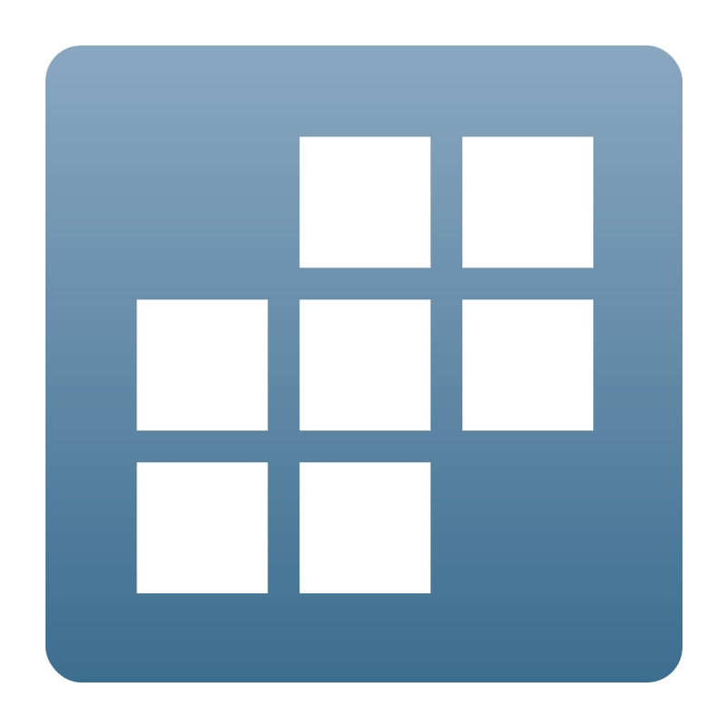

# Reproducible research made easy
{: .fs-9 }

RECAP helps social scientists start projects with fully reproducible, ready-to-use research environments.
{: .fs-6 .fw-300 }

RECAP (Reproducible Environments for Collaborative Academic Projects) generates starter templates for common academic use cases — from short assignments to full-blown research projects.

RECAP templates promote good research practices that enable effective workflows and support reproducibility. These include [version control](/docs/version-control), automated [build pipelines](/docs/build), and, for larger projects, explicit [dependency management](/docs/dependency-management). All of these practices are built into the templates, but none are mandatory: you can start simple and adopt additional structure as your project grows.

Each template provides a complete, [containerized environment](/docs/running-templates). This ensures that analyses can be replicated, that collaborators share the exact same software setup, and that projects can be run either locally with familiar IDEs such as VS Code or RStudio, or directly in the cloud (for example, using GitHub Codespaces).

# Getting started

  

    <h2>Choose your template</h2>
    
Not sure which one to pick? <a href="/docs/choosing-templates">Learn how Small, Medium, and Large differ.</a>

    

      <button type="button" class="template-card" data-template="small">
        
Small

        

          
A single file that runs an analysis and produces a reproducible report

          
For: homework and short assignments

        

      </button>
      <button type="button" class="template-card" data-template="medium">
        
Medium

        

          
A structured workflow with separate cleaning and analysis steps, producing a final report

          
For: final project

        

      </button>
      <button type="button" class="template-card" data-template="large">
        
Large

        

          
A full research pipeline with multiple scripts and deliverables (paper, appendix, slides)

          
For: thesis and long-term collaborative research

        

      </button>
    

  

  

    <h2>Choose your language</h2>
    

      <button type="button" class="language-btn" data-language="r">
        
        R
      </button>
      <button type="button" class="language-btn" data-language="stata" disabled>
        
        Stata
        coming soon
      </button>
      <button type="button" class="language-btn" data-language="python" disabled>
        
        Python
        coming soon
      </button>
    

  

  

    <a id="submitBtn" class="btn btn-primary fs-5" target="_blank">
      Use this template
    </a>
    <a id="detailsBtn" href="/docs/running-templates" class="btn btn-secondary fs-5">
      How to run this template
    </a>
  

